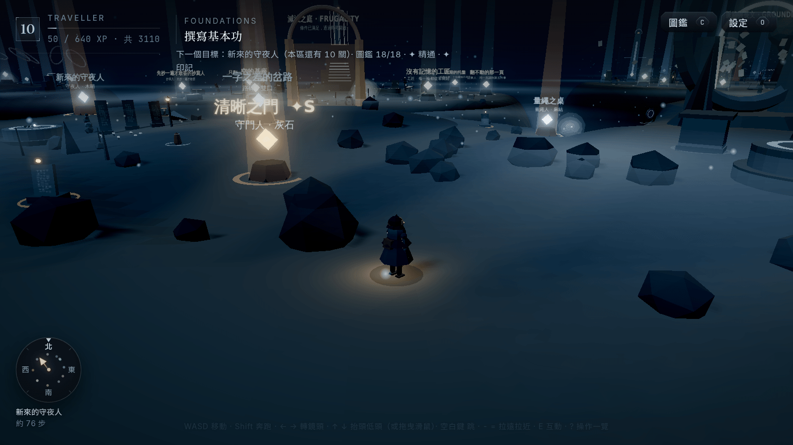
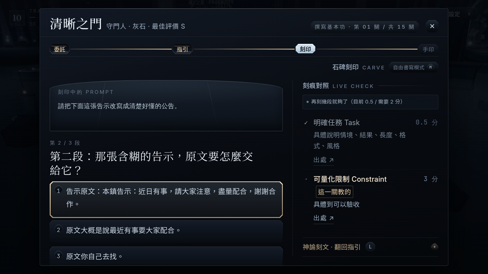
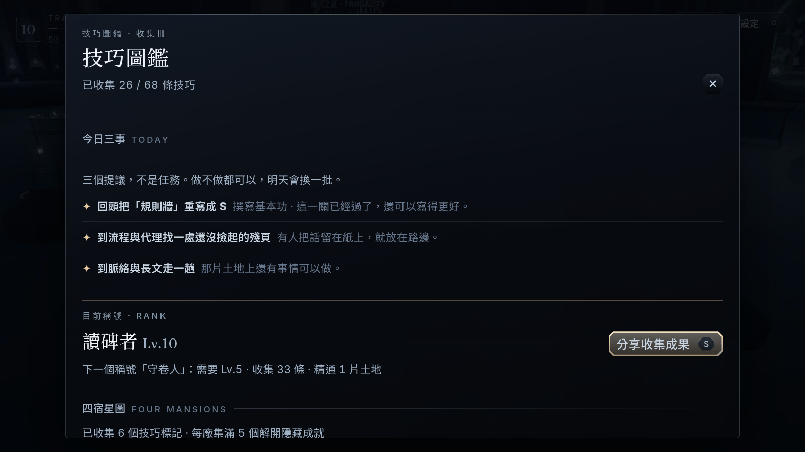
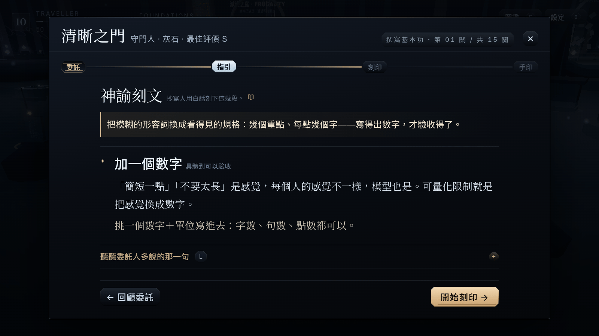
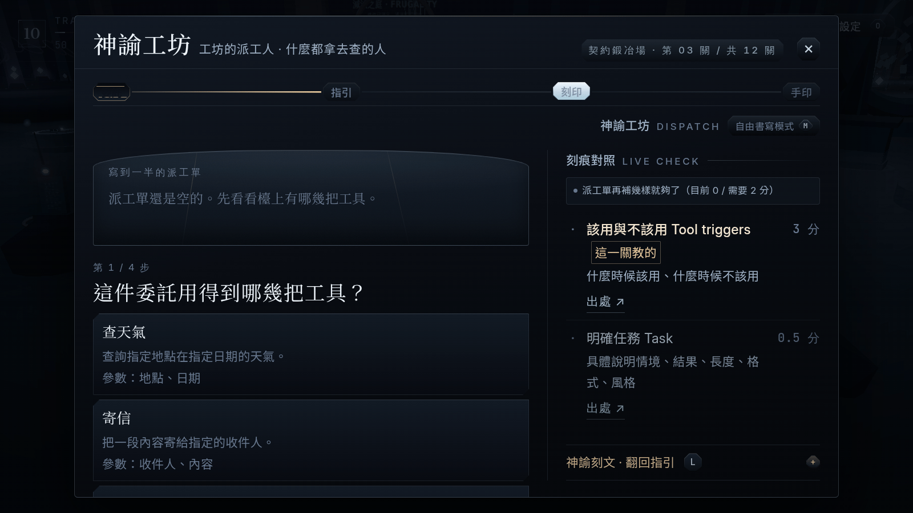
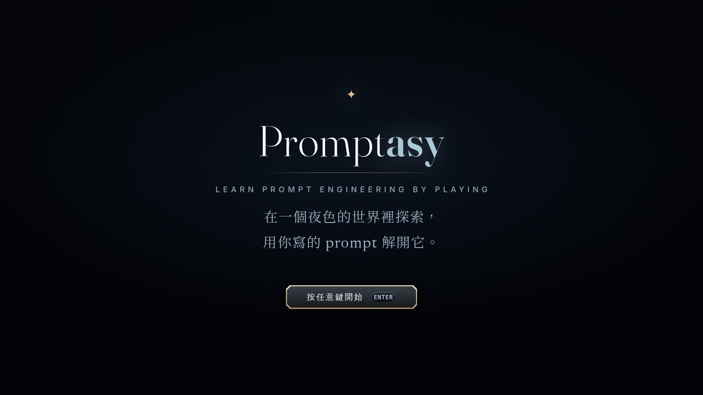

<div align="center">

# Promptasy

**Learn Prompt Engineering by Playing** — *prompt + fantasy*

[**▶ Play it**](https://garyhsieh.com/promptasy) · [Release notes](#release-notes) · [繁體中文](#繁體中文)

[](https://threejs.org/)
[](https://vitejs.dev/)
[](#how-the-offline-scoring-works)
[](#tech-stack)
[](#content--sources)
[](#features)
[](#繁體中文)
[](./LICENSE)
[](#contributing)



</div>

---

## What is this

Promptasy is a browser game where you learn prompt engineering by **playing**, not by reading. You explore a
procedurally generated night world, walk up to a problem — a gatekeeper who can't understand you, an automaton
full of "don't"s, a workshop that needs a dispatch order — and solve it by **constructing a prompt**.

Each of the **130 teaching shrines covers exactly one skill**, taken from **official vendor documentation** — OpenAI,
Anthropic, Google, xAI, Qwen, Mistral and others (**446 source rows, 339 distinct documents**, every one citable
in-game and 370 of them deep-linked straight to the paragraph being quoted). Scoring runs **entirely offline** — no
model calls, no backend, no account — so the core loop works on a plane, in a classroom, or behind a firewall.

The game's default answering mode is **not typing**: you pick sentence fragments and carve them into a stele, so
someone who has never written a prompt can still finish a challenge and learn *why* each fragment works.

Since v1.2 the world also **pushes back**: 20 *murks* — the residue of requests that were once written badly — stand
where they went wrong and grow quiet only as your answer gets clearer; 12 standing *watchmen* and a *gatekeeper* with a
visible system prompt trade hints for the right words; you can jump, take a shortcut, follow rumors between clues, and
in the end rewrite your own very first prompt. Nothing punishes you and nothing expires — progress only accumulates.

> **The game UI is in Traditional Chinese (繁體中文).** The codebase, docs and code comments mix English and
> Chinese. An English UI is not available yet — see [Roadmap](#roadmap).

---

## Screenshots

| Guided challenge — carving a prompt | The codex — 12 lands, every entry cited |
| --- | --- |
|  |  |

| Guidance act — plain-language teaching + its real source | The Oracle Workshop — a tool-dispatch puzzle |
| --- | --- |
|  |  |

<div align="center"></div>

> Captured from the current **v1.2** build with a mid-progress save (level 10, 26 techniques, two land seals), 1600×900,
> real headless Chrome — no mock-ups, no compositing. The codex opens on *three things today*; the world shot shows the
> traveller's lantern, shrine beacons, lore steles, a watchman and an archive hall on the scaled-up plateau.

---

## Features

- **142 challenges across 12 regions** — 130 *teaching shrines* (one shrine ↔ one skill, never taught twice) plus
  12 *application trials*, one per region, that only test what you already learned there. Every gate is a
  **knowledge gate**: it reads the skills you actually collected, not your level — and you can always ask the gate
  to let you through early (it says so honestly, and the skip is recorded).
- **Eleven ways to answer, one scoring engine** — *stele carving*, *order carving*, *repair*, *spot the flaw*,
  *induction*, *trade-off*, *constraint gauges*, *oracle workshop*, *two-round carving*, *dials*, *take-apart* —
  plus *free writing* for people who want to type the whole prompt. Every one of them submits the same text through
  the same offline engine, so grades are identical.
- **You cannot fail, only learn** — a wrong pick is *not accepted* by the stele: it shakes, and a plain-language
  explanation grows next to that option telling you why the weaker phrasing is weaker. No score penalty, no fail screen.
- **A guided prologue** — first boot walks you through four *teach-by-doing* gates (take a step, turn the camera,
  actually run, reach the shrine) and three hands-on lessons on core concepts, all quoted verbatim from vendor docs.
  Skippable, and replayable from settings.
- **Offline rubric engine** — **81 reusable checks** (`hasRole`, `hasFewShot`, `specifiesFormat`, `hasConstraint`,
  `decomposesTask`, `limitsToolSurface`, `rulesBeforeData`, `keepsPromptLean`, …) detect whether a *skill was applied*,
  using structure and bilingual pattern detection rather than string matching. Partial credit, evidence-based
  feedback, and anti-gaming (keyword soup scores zero).
- **Codex you fill up** — 130 skills across 12 regions plus the original 68 techniques in 15 topics, each expandable
  to its explanation, example, model differences and **every original source link**; **12 land seals**, an optional
  master layer (*penless* ✒ / *scribe* ✍ marks that never gate anything), four vendor badges, S/A/B/C grades,
  8 rank titles, and a shareable result card drawn locally on canvas (no third-party SDK, no tracking).
- **Jargon that explains itself** — hovering (or focusing) a technical term anywhere in the UI opens a small glossary
  card; 24 terms, written in plain Chinese.
- **A world worth walking** — a central plateau with bridges and an annex leading to 12 lands, each with its own
  palette, fog, aurora drift and generative lighting; 12 landmarks visible from far away, 14 lore steles,
  13 inscription whispers, 44 interactable objects, 44 proximity reactions, 24 scribe pages, 12 archive halls,
  20 murks, 11 jumpable platforms and 12 map secrets. All procedural — zero model files.
- **Encounters that never punish** — 20 murks (12 great murks) soothed with choice-based answers scored by the same
  engine; 12 watchmen (stationary NPCs) with stuck-hints, directions, lore and technique facts; one gatekeeper whose
  system prompt you can read and must satisfy. Threat never costs you anything — it only gets quieter.
- **A vertical, connected world** — jump (Space) onto 11 platforms and across a broken bridge span; mid-ground
  screens and motifs in every region; one shortcut between neighbouring lands; a map scaled ×1.3 so nothing crowds.
- **A story that closes** — 24 scribe pages, 24 rumor links, 12 echo replays, 12 archive halls (24 cited "why"
  notes), a mid-point reveal, and a finale where you rewrite your first prompt and raise the mother stele — carving
  your own text is explicit, skippable, and never leaves the browser.
- **Progress you can see** — your level is worn on the cape (33 pips × 3 rings = 99); "three things today" are
  suggestions, not tasks (no expiry, no streaks, switchable off); the hidden achievement equals the finale threshold.
- **Real soundtrack** — **13 original tracks** (title + one per region, cross-faded when you cross a bridge) and
  **24 SFX**. If the audio files are missing or blocked, a **Web Audio synth fallback** takes over and the game still
  sounds alive.
- **Keyboard-first** — the whole journey is playable without a mouse; focus traps, restored focus, visible focus rings,
  `prefers-reduced-motion`, and a `?` key that shows every binding at any time.
- **Self-hosted OFL fonts** — 6 families subset to **~1.50 MB** from the project's actual corpus. **Zero CDN, zero
  external requests at runtime.**
- **Progress in localStorage** — no account, no server. Settings page has a one-click "reset and relearn" (with
  confirmation).
- **Static deploy** — `npm run build` produces a folder you can drop on GitHub Pages, Netlify or Vercel.

---

## Quick start

```bash
npm install
npm run dev          # local dev (http://localhost:5173)
npm run build        # static output to dist/
npm run preview      # preview the build
```

Requires **Node.js 18+**. `npm run test:e2e` additionally needs a system Chrome/Chromium (`CHROME_PATH` to point at it).

---

## Controls

> The whole game is playable from the keyboard. Press <kbd>?</kbd> at any time for the in-game list.

| Key | Action | 作用 |
| --- | --- | --- |
| <kbd>W</kbd><kbd>A</kbd><kbd>S</kbd><kbd>D</kbd> | Move | 移動 |
| <kbd>Shift</kbd> | Run | 奔跑 |
| <kbd>←</kbd><kbd>→</kbd> / drag | Turn camera | 轉鏡頭 |
| <kbd>↑</kbd><kbd>↓</kbd> | Look up at the sky / down | 抬頭看天空 / 低頭 |
| <kbd>Space</kbd> | Jump — onto the 11 platforms, across the broken bridge span | 跳：跳上高台、跳過橋的缺口 |
| <kbd>-</kbd><kbd>=</kbd> / wheel | Zoom out / in | 鏡頭拉遠 / 拉近 |
| <kbd>E</kbd> | Interact — shrine, murk, watchman, gatekeeper, lore stele, inscription, page, object, bench, echo, gate | 互動：石座 / 濁靈 / 守夜人 / 守門者 / 石碑 / 刻文 / 殘頁 / 器物 / 長凳 / 回聲 / 閘門 |
| <kbd>C</kbd> | Codex | 技巧圖鑑 |
| <kbd>O</kbd> | Settings (volume, quality, answering mode, reset) | 設定 |
| <kbd>?</kbd> | Key list | 操作一覽 |
| <kbd>F3</kbd> | Performance monitor | 效能監視器 |

Inside a challenge:

| Key | Action | 作用 |
| --- | --- | --- |
| <kbd>Enter</kbd> | Act I / II: read it, move on | 讀完了，往下一幕 |
| <kbd>1</kbd><kbd>2</kbd><kbd>3</kbd> | Pick the fragment for this segment | 選這一段要填哪一句 |
| <kbd>Enter</kbd> | Pick up a slab or a value stone, press again to drop it | 拿起一片石版或值石，再按一次放下 |
| <kbd>↑</kbd><kbd>↓</kbd> | Move focus between options — or move the thing you are holding | 移動焦點／搬動拿著的東西 |
| hold <kbd>Enter</kbd> | Press your palm to the full stele — submit | 手掌按上石碑，呈給神諭 |
| <kbd>Alt</kbd>+<kbd>1</kbd>…<kbd>4</kbd> | Jump to an act you've already seen | 直接回到某一幕 |
| <kbd>L</kbd> / <kbd>H</kbd> / <kbd>M</kbd> / <kbd>S</kbd> | Clue / hint / answering mode / share | 線索 / 提示 / 答題方式 / 分享 |
| <kbd>Ctrl</kbd>／<kbd>⌘</kbd>+<kbd>Enter</kbd> | Free-writing mode: submit | 自由書寫模式：送出 |
| <kbd>Esc</kbd> | Close the top layer | 收起最上面那一層 |

Single-key shortcuts are disabled whenever a text field has focus — while writing a prompt, letters are just letters.

---

## How the offline scoring works

Each challenge carries a data-defined rubric. A check is a reusable function that looks for *structure*, not for a
magic string, and can award partial credit with an explanation of what is missing. Since curriculum v2 a teaching
shrine grades **one primary skill (weight 3) plus at most one foundation check (weight 0.5)** — so a shrine can only
be beaten by the thing it actually teaches:

```jsonc
// src/data/challenges.json — the first shrine, abridged
{
  "id": "gate-of-clarity-01",
  "region": "foundations",
  "primarySkillId": "clear-specific",
  "primaryTechniqueId": "clarity-03",
  "rubric": [
    { "check": "assignsTask",   "weight": 0.5, "foundation": true, "techniqueId": "clarity-02", "hint": "…" },
    { "check": "hasConstraint", "weight": 3,   "primary": true,
      "techniqueId": "clarity-03", "skillId": "clear-specific", "hint": "…" }
  ],
  "pass": 2,
  "source": "https://learn.microsoft.com/en-us/azure/ai-foundry/openai/concepts/prompt-engineering#best-practices"
}
```

Every `techniqueId`, `skillId` and `source` must resolve to a real catalogue entry and a real official URL — the test
suite refuses to pass otherwise.

- 81 checks, bilingual (Chinese + English) detection, multi-level partial credit.
- Grades: **S ≥ 95%**, **A ≥ 78%**, **B ≥ 60%**, **C** = reached the pass threshold. Replaying for a better grade only
  tops up the XP difference.
- Anti-gaming is *not* relaxed: empty text, gibberish and keyword soup all score zero.
- **The core loop never calls a model.** Everything above runs in the browser, from data in the repo.

---

## Project structure

```
promptasy/
├─ CLAUDE.md               # north star: vision, guardrails, engineering harness, changelog
├─ AGENTS.md               # how an AI agent should work in this repo
├─ WORLD.md                # world bible: interaction grammar, placement rules, perf/collision rules
├─ docs/
│  ├─ design/              # curriculum v2 design, migration manifest, source-anchor audit
│  ├─ media/               # README screenshots + og image
│  └─ promptbooks/         # 2026-07 audit of vendor docs + gap analysis
├─ public/
│  ├─ audio/               # 13 BGM + 24 SFX (m4a)
│  ├─ fonts/               # self-hosted OFL subsets + license texts
│  └─ LICENSE.md           # per-asset licensing
├─ scripts/                # subset-fonts, rubric tests, playtest verifier, headless e2e, audits
└─ src/
   ├─ engine/              # renderer, camera, sky/stars/aurora, post-processing, loop
   ├─ world/               # 12 regions, bridges, annex, gates, shrines, props, landmarks, lore steles
   ├─ player/              # controller, follow camera, rigless procedural character
   ├─ challenges/          # offline rubric engine, 81 checks, v2 catalogue loader
   ├─ prompt/              # the four-act challenge console, eleven board types, practice bench
   ├─ progression/         # XP, unlocks, codex, seals, badges, ranks
   ├─ audio/               # file-first BGM/SFX with synth fallback
   ├─ ui/                  # title, entry gate, HUD, codex, settings, glossary, share card, panels
   ├─ save/                # localStorage read/write, migration, reset
   └─ data/                # curriculum.json (verbatim) + skill-codex-v2 + game-authored layers
```

---

## Testing

| Command | What it covers | Time | Latest run |
| --- | --- | --- | --- |
| `npm run test:rubric` | Scoring engine, data integrity, source health, collision audit, Chinese-only scan, font-corpus fingerprint, save migration | ~42 s | **227,303 assertions passing** |
| `npm run test:playtest` | Every challenge is beatable by following the on-screen help: sample answer ≥ A, quick-fills always pass, weak starters always fail, misjudgement regressions | ~0.2 s | **2,824 assertions passing** |
| `npm run build` | Vite build | ~2 s | passing |
| `npm run test:e2e` | Headless Chrome playthrough over CDP (walking, prologue, all eleven board types, passing, sharing) — no puppeteer/playwright, just Node + system Chrome; a second browser instance replays the entry gate under the default autoplay policy | ~23 min on this software-rendering box | **4,990 checks passing, zero console errors** (three consecutive full runs, no reruns) |

---

## Content & sources

Content accuracy is a hard rule in this repo:

- **`src/data/curriculum.json` is byte-preserved.** Technique text, examples and links were extracted verbatim from the
  source compilation and are never edited — 68 techniques, 15 topics, 105 technique-level source links, and a
  24-entry table of official documents. The 130-skill v2 catalogue (`src/data/skill-codex-v2.json`) sits **beside** it
  as a separate authored layer, with all **446 source rows** (339 distinct documents) parsed row-by-row out of the
  research master list.
- **Sources are deep links where a deep link exists.** A 2026-08 audit walked every URL the game can display:
  370 of the 446 v2 rows now jump straight to the cited section (heading id, repaired id, or a W3C `#:~:text=`
  fragment); the remaining 76 stay at page level *on purpose*, and say why. The legacy 68 techniques get the same
  treatment through a display-layer overlay (`src/data/source-anchors.json`, 64 entries). The audit log is in
  [`docs/design/source-anchor-audit.md`](docs/design/source-anchor-audit.md).
- **Anything the game writes itself lives in a separate layer** marked `authored: "game"` (plain-language coaching,
  Chinese demonstrations, challenge flows, glossary, rank titles, lore) and always points back to a real official link.
  A translation can never be displayed as if it were an official quote.
- **When a vendor doc goes stale, we annotate — we don't rewrite.** Dated notes live in `src/data/dated-notes.json`
  (last checked 2026-07). The audit that produced them, including a per-vendor gap analysis, is in
  [`docs/promptbooks/`](docs/promptbooks/).

Ten vendors are cited in total; the four biggest entry points:

| Vendor | Official documentation |
| --- | --- |
| OpenAI | [Prompt engineering](https://developers.openai.com/api/docs/guides/prompt-engineering) · [Best practices](https://help.openai.com/en/articles/6654000-best-practices-for-prompt-engineering-with-the-openai-api) |
| Anthropic | [Prompt engineering overview](https://platform.claude.com/docs/en/build-with-claude/prompt-engineering/overview) |
| Google | [Prompt design strategies](https://ai.google.dev/gemini-api/docs/prompting-strategies) |
| xAI | [Grok 4.5 guide](https://docs.x.ai/developers/grok-4-5) — the older Grok prompt-engineering guide the v1.0 codex quotes has since been taken down; the game keeps the original URL *and* prints a dated note pointing here |

…plus Mistral, Meta, Microsoft, Cohere, Qwen and DeepSeek across the v2 catalogue. Every codex entry links to its own
original document, health-checked by the test suite.

---

## Tech stack

Vite · vanilla JS · three.js (world + post-processing) · Web Audio (file-first playback with a synth fallback) ·
localStorage · self-hosted OFL font subsets. **No framework, no backend, no accounts, no database, and zero external
requests at runtime.**

---

## Release notes

### v1.2 — 2026-09-10（濁靈之夜）

The "night of the murks" release: the curriculum did **not** grow (still 12 regions / 142 challenges / 130 skills) —
what grew is the **world and the play**. Everything below is offline, saved locally, and reversible.

- **Encounters** — 20 *murks* (12 of them *great murks*) stand where a badly-written request once went wrong; you soothe
  them with choice-based answers scored by the same engine. Threat never punishes: a murk only grows quieter as you get
  clearer. 12 *watchmen* (standing NPCs) trade hints, lore, directions and technique facts; one *gatekeeper* at the
  wards carries a visible system prompt you must actually satisfy.
- **A vertical world** — jump (**Space**), 11 platforms, a broken bridge span, mid-ground screens and motifs in every
  region, one shortcut between neighbouring lands, and a map scaled up ×1.3 so nothing is crowded any more.
- **The story closes** — 24 scribe pages, rumor links between clues, 12 echo replays, 12 archive halls with 24 cited
  "why" notes, a mid-point reveal, and a finale where you rewrite your own first prompt and raise the mother stele.
  Your text is never uploaded; carving it is explicit and skippable.
- **Progress you can see** — your level is worn on the cape (33 pips × 3 rings = 99); "three things today" are
  *suggestions, not tasks* (no expiry, no streak, off in settings); achievement now equals the finale threshold.
- **Performance** — draw calls −27%, additive transparent quads −38%, materials −33%; both now live in the test
  contract so they cannot regress silently. Triangles, lights (37) and colliders unchanged.
- **Polish** — full `prefers-reduced-motion` coverage (motion stops, information stays), a real focus-trap bug fixed
  (48 of 76 codex focusables were unreachable), one mis-measured track peak corrected, and the 15 layout/copy
  issues found by an exploratory Playwright playtest fixed and re-verified.
- **Tests** — 227,303 rubric assertions, 2,824 playtest gates, 4,990 headless e2e checks — three consecutive green
  runs with zero reruns after every wall-clock wait in the harness was replaced by condition/frame polling.

Touch controls are deferred to the next release (tracked in [#4](https://github.com/romanticamaj/promptasy/issues/4)).

### v1.1 — 2026-08-03（課程 v2）

The curriculum v2 release: the world grew from 5 regions and 27 challenges to **12 regions and 142 challenges**,
live at **[garyhsieh.com/promptasy](https://garyhsieh.com/promptasy)**.

- **130 teaching shrines + 12 application trials across 12 regions** — one shrine teaches exactly one of the
  **130 skills** (446 sourced rows, 339 distinct official documents); the 27 v1.0 challenges were migrated, not
  deleted, and the original 68-technique codex is still collectable underneath.
- **Eight new puzzle kinds** on top of stele carving, order carving and the workshop: *repair*, *spot the flaw*,
  *induction*, *trade-off*, *constraint gauges*, *two-round carving*, *dials* and *take-apart* — eleven in total,
  all scored by the same offline engine.
- **One shrine grades one skill**: rubrics were rebuilt as *primary skill (3) + at most one foundation check (0.5)*,
  killing the "every challenge tests the same three things" repetition of v1.0. 59 → **81 checks** landed.
- **Knowledge-based soft gates** — a bridge gate now reads the skills you collected rather than your level, and every
  gate can be asked to let you through early (honestly recorded, never silently).
- **Land seals & master marks** — 12 land seals from the application trials, plus an optional *penless* / *scribe*
  master layer that gates nothing.
- **A real soundtrack for all twelve regions** — 13 original tracks and 24 SFX; the synth engine stays as fallback.
- **Sources became deep links** — 370 of 446 v2 rows (and 64 legacy overlays) jump to the exact cited section.
- **A 142-challenge content audit** plus a pre-release test-debt cleanup: 80,453 rubric assertions, 2,372 playtest
  gates and 3,357 headless e2e checks, all green with zero console errors and no flaky reruns.
- **Sharing** — result card (image + caption) to the system share sheet, or to Threads / Facebook with the site URL.

### v1.0 — 2026-08-01（首個正式版）

The first full release, live at **[garyhsieh.com/promptasy](https://garyhsieh.com/promptasy)**.

- **27 challenges / 68 techniques / 5 regions** — every technique cited to official OpenAI / Anthropic / Google / xAI docs; fully offline rubric scoring (22 structural checkers, no model calls).
- **Four interaction kinds**: stele choice-carving（石碑刻印）, drag-to-order（排序刻印）, tool-dispatch workshop（神諭工坊）, and free writing — all inside a director-style four-act flow（委託 → 神諭刻文 → 刻印 → 手印）.
- **A living night world**: guided prologue（序章「喚醒神諭」）, humanoid traveler, 8 kinds of RPG interactables, proximity reactions, lore steles & inscriptions, hidden secrets, compass & wayfinding nudges.
- **Original score**: 6 BGM tracks (Gary Hsieh × SUNO.ai) with per-region crossfades + 10 Splice SFX; cinematic opening (entry gate → fade-in title).
- **Progression & sharing**: XP / 8 rank titles / region mastery / vendor badges, shareable result cards.
- **Fully keyboard-playable**; localStorage saves with migration; Traditional-Chinese-first UI.
- Quality floor: 16,000+ data/engine assertions, 220+ playtest gates, ~1,780 headless e2e checks.

---

## Roadmap

- **Mobile**: touch joystick and a layout for viewports under 720 px — the biggest remaining gap, deliberately
  deferred out of v1.2 (spec in [#4](https://github.com/romanticamaj/promptasy/issues/4); panels already fit 390 px,
  but walking the world still needs a keyboard).
- An English UI layer (the scoring engine already detects both languages).
- An optional online grading layer, as an add-on to — never a replacement for — the offline engine.
- More "the world remembers what you solved" environmental storytelling.

---

## Contributing

Issues and PRs are welcome. Before touching anything, read [`CLAUDE.md`](./CLAUDE.md) (guardrails and changelog),
[`AGENTS.md`](./AGENTS.md) (workflow, testing policy, landmines) and [`WORLD.md`](./WORLD.md) (world rules).
Two hard rules: **`curriculum.json` is never edited**, and **the core loop must stay playable offline**.

If you change player-visible Chinese strings, re-run `npm run fonts` — the font-corpus fingerprint test will fail
otherwise.

---

## Credits

- **Music** — 13 original tracks (title + one per region) by **Gary Hsieh**, produced with **SUNO.ai** assistance;
  licensed for use in this project.
- **Sound effects** — 24 Splice samples under the Splice sample license (licensed to the author's account).
- **Fonts** — all **SIL OFL 1.1**, self-hosted as subsets, license texts redistributed in `public/fonts/`:
  [Fraunces](https://github.com/google/fonts/tree/main/ofl/fraunces),
  [Newsreader](https://github.com/google/fonts/tree/main/ofl/newsreader),
  [Inter](https://github.com/google/fonts/tree/main/ofl/inter),
  [JetBrains Mono](https://github.com/google/fonts/tree/main/ofl/jetbrainsmono),
  [Noto Serif TC](https://github.com/google/fonts/tree/main/ofl/notoseriftc),
  [Noto Sans TC](https://github.com/google/fonts/tree/main/ofl/notosanstc).
- **World, character and effects** — 100 % procedural three.js; no purchased or downloaded model files.
- **Technique content** — © the respective vendors; quoted with attribution and linked to the original documents.

Per-asset licensing is recorded in [`public/LICENSE.md`](./public/LICENSE.md).

---

## License

**Code: [MIT](./LICENSE).** The source code of this repository is fully open source under the MIT License.
**Assets are licensed separately** — see [`public/LICENSE.md`](./public/LICENSE.md) (fonts are OFL 1.1 and
redistributable; music and SFX are licensed to this project and are **not** free to reuse elsewhere). Technique text
and links remain the property of their original vendors.

---

<div align="center">

## 繁體中文

</div>

**Promptasy 是一款在瀏覽器裡「邊玩邊學 prompt engineering」的探索型遊戲。**
你在一個夜色的世界裡走動，遇到問題（聽不懂話的守門人、滿身「不要」的自動機、需要派工的工坊），
然後**把 prompt 組出來**解開它。解開就得經驗、解鎖新區域、把技法收進圖鑑。

### 為什麼一般人也玩得動

- **預設不用打字**。石碑刻印是一段一段的選擇建構題：一次只問你一句話該說什麼，從 2–3 個選項裡挑。
  選對就刻上石碑；**選錯不會失敗**，石碑只是「不收」，旁邊長出一句白話說明告訴你為什麼那樣寫比較弱。
- **十一種動手題型 ＋ 自由書寫**：石碑刻印、排序刻印、改碑、點碑、推規碑、雙面碑、合尺、神諭工坊、
  兩輪刻印、轉鈕、拆碑；想自己打整段的人隨時可以切到自由書寫模式。全部送出的都是同一段文字、
  走同一支離線評分引擎，所以評價完全一致。
- **一座神廟只教一條技法**：評分表是「主技法 3 分 ＋ 最多一條基本功 0.5 分」，不會每一關都在考同樣三件事。
- **門檻看你會什麼，不看等級**：橋上的門讀的是你收集到的技法；不夠也可以「先行前往」，而且會誠實記下來。
- **先上一堂引導課程**：序章「喚醒神諭」有四道要真的做到才過的門檻，再帶三堂核心概念實作課。可跳過、可重看。
- **即時預檢**：還沒送出，畫面右邊就一盞一盞亮起「你已經做到哪幾項」；卡住時右下角的提示球會給你可以直接填的句子。
- **看不懂的詞就地解釋**：畫面上的技術名詞滑過去（或用鍵盤聚焦）就開一張小卡，共 24 條白話說明。- **看不懂的詞就地解釋**：畫面上的技術名詞滑過去（或用鍵盤聚焦）就開一張小卡，共 24 條白話說明。
- **遭遇不懲罰（v1.2）**：路上站著 20 隻濁靈——當年寫壞的請求留下的東西。走近按 E，用選的把話講清楚，牠就一層一層安靜下來；
  不會扣分、不會失敗、不會追你。12 位守夜人站著等你問路（卡關提示、指路、世界觀、技巧小知識），護欄崗的守門者身上掛著
  一份看得見的 system prompt，要說出對得上的話才放行。
- **世界有高低、有捷徑（v1.2）**：空白鍵跳，11 座高台、一段塌掉的橋要跳過去，齒輪工坊到量器坊有一條推得開的吊板。
- **故事會收尾（v1.2）**：殘頁、傳聞連線、回聲重演、檔案廊小知識，到分歧之廳的中點揭示，最後在斷環旁**把你自己的第一句話
  重寫一遍**、立起母碑——你的字只留在瀏覽器裡，刻不刻都由你。
- **進度看得見、不催人（v1.2）**：等級穿在披肩上（一圈 33 格 × 三圈 ＝ 99）；「今日三事」是提議不是任務——做不做都可以，
  明天換一批，不想看就關掉。

### 內容與出處（護欄）

- `src/data/curriculum.json` **一個位元組都不改**：68 條技巧 / 15 主題 / 105 條技巧出處 / 24 條官方文件總表，
  全部逐字保留，圖鑑每一條都點得到原始連結。130 條技能的 v2 課程（`src/data/skill-codex-v2.json`）是**另一層**
  自撰資料，**446 列出處**（339 份相異官方文件）逐條解析自研究總表，每一座神廟都指得回真實官方文件。
- **出處盡可能直接跳到被引用的那一節**：446 列裡有 370 列帶得出章節錨點或文字片段，其餘 76 列誠實停在頁面層
  並寫明理由；舊 68 條走顯示層疊加（`src/data/source-anchors.json`，64 條）。稽核紀錄在
  [`docs/design/source-anchor-audit.md`](docs/design/source-anchor-audit.md)。
- 遊戲自撰的白話教學、中文示範、關卡流程、術語小卡一律放在標了 `authored: "game"` 的獨立資料層，並附真實官方連結 ——
  **翻譯不可能被當成官方引文顯示**。
- 官方文件過時的地方用「時代註記」層（`src/data/dated-notes.json`，最後查核 2026-07）標出來，不改原文；
  稽核過程在 [`docs/promptbooks/`](docs/promptbooks/)。

### 快速開始

```bash
npm install
npm run dev      # 本機開發
npm run build    # 靜態輸出 dist/
```

需要 Node.js 18 以上。進度存在 localStorage（無帳號、無伺服器），設定頁可一鍵重置重學。

### 規模

142 個關卡（130 座教學神廟 ＋ 12 座應用試煉）· 12 片土地 · 130 條技能（底下仍逐字保留 68 條原技巧）·
81 個離線檢查器 · 11 種題型 ＋ 自由書寫 · 520 段刻印題（1,233 個選項）· 12 座地標 · 14 塊世界觀石碑 ·
13 則刻文小語 · 44 件動得了的器物 · 44 處會回應的東西 · 24 頁抄寫人的殘頁 · 20 隻濁靈（其中 12 隻大濁靈）·
12 個藏起來的地方 · 11 座跳得上去的高台 · 12 位守夜人 ＋ 1 位守門者 · 12 座檔案廊（24 則小知識）·
24 張術語小卡 · 12 枚土地印記 · 8 個稱號 ·
13 首原創配樂 ＋ 24 支音效 · 1.50 MB 自架 OFL 字型 · **零 CDN、零外部請求、零後端**。

測試現況：`test:rubric` 227,274 · `test:playtest` 2,824 · `test:e2e` 4,930（零 console error）。

> 更長期的目標、開發護欄與逐 phase 變更紀錄都在 [`CLAUDE.md`](./CLAUDE.md)。
